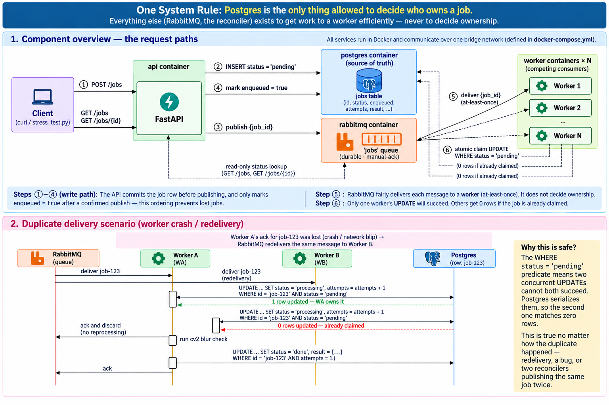
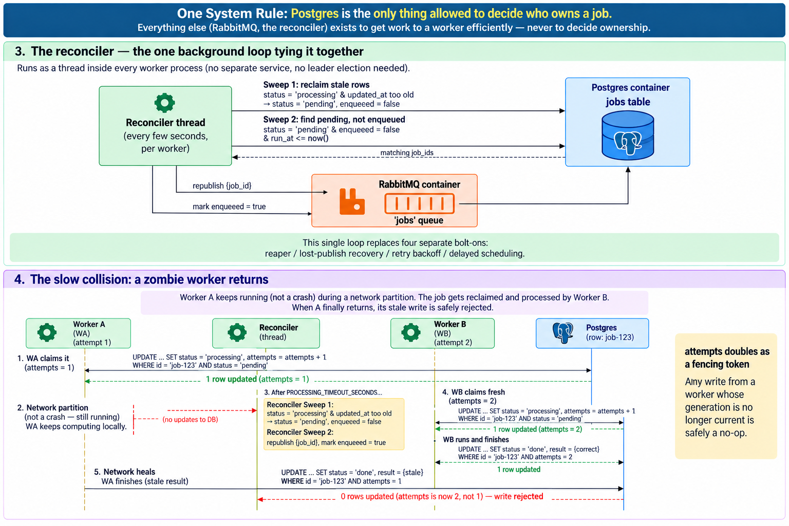

# DESIGN.md — Image Job Processing Service



## Exactly-once processing

**Postgres is the only thing allowed to decide who owns a job — RabbitMQ only decides who gets a shot at one.** RabbitMQ gives at-least-once delivery (a message can be redelivered after a crash, a network blip, or a broker failover), so ownership can't be decided at the queue level. It's decided by one atomic, conditional UPDATE:

```sql
UPDATE jobs SET status='processing', attempts=attempts+1, updated_at=now()
WHERE id=:job_id AND status='pending'
RETURNING *;
```

Two workers can never both win this for the same row — Postgres serializes concurrent `UPDATE`s, so a duplicate delivery's second attempt always matches 0 rows and is acked-and-discarded, no reprocessing.

That covers a collision at claim time (milliseconds apart, above). The slower case — a worker that goes silent (network partition, not a crash) long enough for the reconciler to reclaim its job and hand it to someone else, then resurfaces and tries to report a now-stale result — needs one more guard: `attempts` doubles as a **fencing token**. Every write a worker makes for a job (not just the claim) is conditioned on the exact `attempts` value it claimed with:

```sql
UPDATE jobs SET status='done', result=:result WHERE id=:job_id AND attempts=:attempts_claimed_with;
```

By the time a resurfacing zombie worker tries this, a later claim has already bumped `attempts`, so its write matches 0 rows and is safely discarded.



## Queue choice: RabbitMQ

A plain Postgres table (per the assignment's own hint) would also satisfy exactly-once — the claim UPDATE above doesn't need a broker to exist. RabbitMQ is used instead for push delivery (no polling tax on Postgres as worker count grows) and automatic redelivery on a dropped connection. Trade-offs argued in both directions, including a worked example quantifying the polling cost RabbitMQ avoids.

## Bonus features (retries, crash recovery, scheduled jobs)

All three turned out to be one mechanism: a `run_at` column plus a background reconciler thread (inside every worker) that (1) reclaims jobs stuck `processing` past a timeout and (2) republishes any `pending`, not-yet-enqueued job whose `run_at` has passed. A retry sets `run_at = now() + backoff` (2s/4s/8s, up to 3 attempts); a scheduled job sets `run_at` to the requested future time; a crash/hang reclaim resets `run_at` to null. No RabbitMQ dead-letter/TTL topology or delayed-message plugin needed.

## Blur detection & determinism

Variance of the Laplacian of the grayscale image, threshold **100.0** (`is_blurry = variance < 100.0`), configurable via `BLUR_THRESHOLD`. Determinism depends on three things staying fixed: decoding with `cv2.imread(path, cv2.IMREAD_GRAYSCALE)` (no separate `cvtColor` step), rounding the stored variance to a fixed precision, and pinning the exact OpenCV version in `requirements.txt` (different builds can decode JPEGs a few pixel values apart, enough to move the variance).

## Assumptions

- **`GET /jobs/{id}` includes `attempts` in the response**, in addition to the spec-listed `id`/`status`/`result`/`created_at`/`updated_at`. The spec doesn't list it, but `stress_test.py` is required to assert `attempts == 1` for every job and has no other way to read that value via the API.
- **`GET /jobs` pagination is `?limit=&offset=`** (default `limit=20`, capped at `100` server-side regardless of what's requested), combined with the spec'd `?status=` filter.
- `image_path` is a path already accessible **inside the worker container** (`sample_images/` is mounted read-only into `api` and `worker`, so paths line up across host and containers).
- Postgres, not SQLite, for the Docker/multi-worker setup — SQLite's whole-file write lock forces unrelated workers to serialize against each other even when claiming different jobs; Postgres locks per-row. SQLite remains fine for running `tests/` without Docker.
- No auth, no multi-tenancy — matches assignment scope.
- "Exactly-once" is guaranteed for the *effect* (a job's terminal state is written once), not for message delivery or for computation — a zombie worker's wasted CPU cycles are an accepted cost of the rare failure mode above, never its recorded result.
- A `failed` job is not retried beyond `MAX_RETRIES` (bonus); without that bonus enabled, one failure is terminal.
